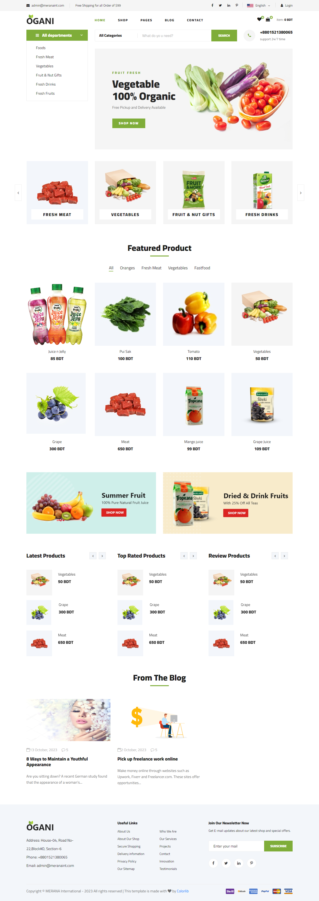
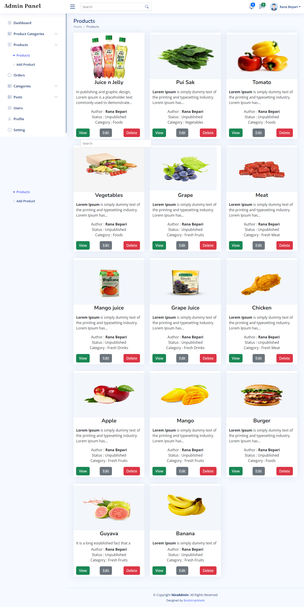
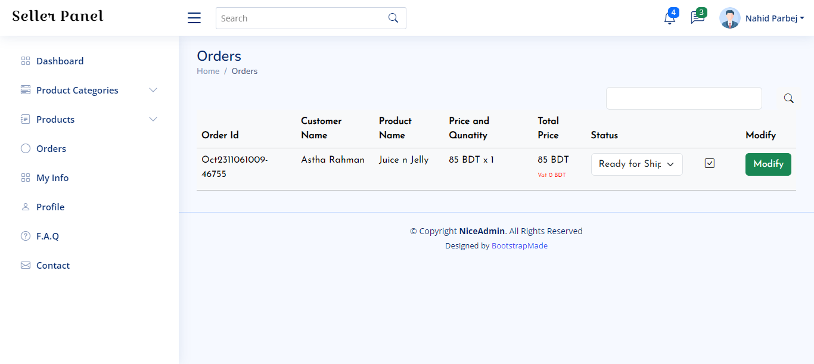
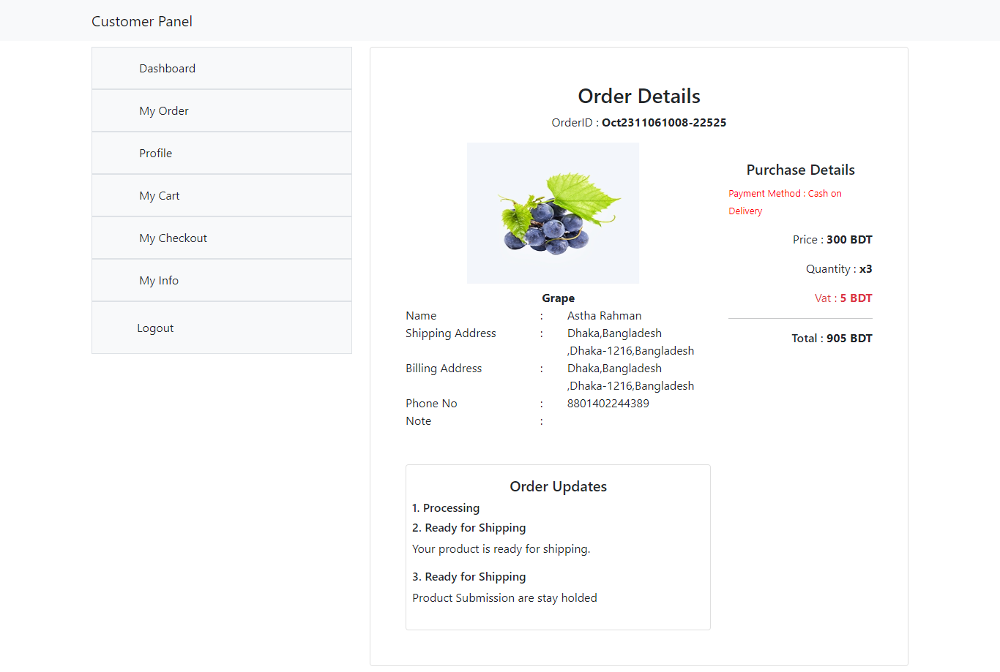

# ecommerce_oagni
This is a laravel ecommerce project and used as sample of my work

<a href="https://ecommerce.rana.meranaint.com">Live Website of Oagni Ecommerce Website</a>
 

 

<h3>Admin Panel</h3> 
 

 

<h3>Seller Panel</h3>
  

 

<h3>User Panel</h3>
  

Thanks,  
Rana Bepari  
<a href="https://rana.meranaint.com/">https://rana.meranaint.com/</a>
